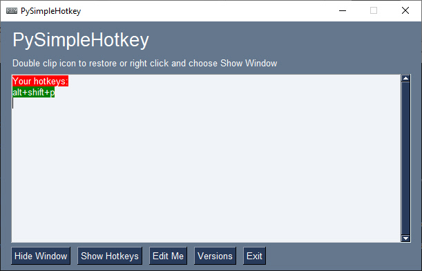

[description]
Windows Hotkeys Tool

TBD

[features]
* A complete hotkey manager
* Demonstrates integrating the system tray into your application
* Example sophisticated docstring formatting application of a hotkey

[extras]

# Packages Used

This project uses these pip installable packages:
* PySimpleGUI
* psgtray
* keyboard

# Mash-up

This project is a mash-up of some PySimpleGUI demo programs and a program called [pingmote](https://github.com/dchen327/pingmote).  The `pingmote` project is the origin of the keyboard handler.  A big thank you to @dchen327 for the code and inspiration.

The system tray code is from the [psgtray](https://github.com/PySimpleGUI/psgtray).  The psgtray package is an important add-on to the tkinter port of PySimpleGUI as it enables you to run your applications in the system tray.

<p align="center"><p>


# Docstring Utilities

The reason that a hotkey was needed in the first place was a convenient way to launch a couple of simple utilities that operate on the clipboard.  They both read the clipboard, look for a doctring, modify the docstring, and save the result back onto the clipboard.

The idea is to have a workflow that follows these steps:

* Text with docstring is copied onto clipboard
* Hotkey is pressed to invoke one of the docstring tools
* The modified clipboard is pasted into the code

## AlignDocstrings.py

This program reads a docstring and lines up the description and types.  It assumed the format of the docstrings is the one used by the PySimpleGUI project.

An example is the easiest way to show what it does.

## Input

This is the input that is on the clipboard:

```python
def execute_py_file(pyfile, parms=None, cwd=None, interpreter_command=None, wait=False, pipe_output=False):
    """
    Executes a Python file.
    The interpreter to use is chosen based on this priority order:
        1. interpreter_command paramter
        2. global setting "-python command-"
        3. the interpreter running running PySimpleGUI

    :param pyfile: the file to run
    :type pyfile: (str)
    :param parms: parameters to pass on the command line
    :type parms: (str)
    :param cwd: the working directory to use
    :type cwd: (str)
    :param interpreter_command: the command used to invoke the Python interpreter
    :type interpreter_command: (str)
    :param wait: the working directory to use
    :type wait: (bool)
    :param pipe_output: If True then output from the subprocess will be piped. You MUST empty the pipe by calling execute_get_results or your subprocess will block until no longer full
    :type pipe_output: (bool)
    :return: Popen object
    :rtype: (subprocess.Popen) | None
    """
```

## Output


This is the result that is left on the clipboard:

```python
def execute_py_file(pyfile, parms=None, cwd=None, interpreter_command=None, wait=False, pipe_output=False):
    """
    Executes a Python file.
    The interpreter to use is chosen based on this priority order:
        1. interpreter_command paramter
        2. global setting "-python command-"
        3. the interpreter running running PySimpleGUI

    :param pyfile:              the file to run
    :type pyfile:               (str)
    :param parms:               parameters to pass on the command line
    :type parms:                (str)
    :param cwd:                 the working directory to use
    :type cwd:                  (str)
    :param interpreter_command: the command used to invoke the Python interpreter
    :type interpreter_command:  (str)
    :param wait:                the working directory to use
    :type wait:                 (bool)
    :param pipe_output:         If True then output from the subprocess will be piped. You MUST empty the pipe by calling execute_get_results or your subprocess will block until no longer full
    :type pipe_output:          (bool)
    :return:                    Popen object
    :rtype:                     (subprocess.Popen) | None
    """
```


## AddTypesToDocstring.py

PyCharm will automatically create a docstring for you. After a function definition, if you enter `"""` then it will populate the docstring using the parameters found in the function definition.  It's a nice feature.

But.... the format of these docstrings is not the 2-line format used by the PySimpleGUI documentation creation tools (call reference in particular).  This utility simply adds the `type` and `rtype` lines in the docstring.  Like the other docstring tool, it takes the clipboard as input and places the result onto the clipboard.

## Input

```python
def execute_py_file(pyfile, parms=None, cwd=None, interpreter_command=None, wait=False, pipe_output=False):
    """

    :param pyfile:
    :param parms:
    :param cwd:
    :param interpreter_command:
    :param wait:
    :param pipe_output:
    :return:
    """
```


## Output

This utility only leaves the docstring on the clipboard.  Any other text before or after is stripped off.  As you can see, the difference is that each `param` line has a mataching `type` line and the `return` has a matching `rtype`.

```python
    """

    :param pyfile:
    :type pyfile:
    :param parms:
    :type parms:
    :param cwd:
    :type cwd:
    :param interpreter_command:
    :type interpreter_command:
    :param wait:
    :type wait:
    :param pipe_output:
    :type pipe_output:
    :return:
    :rtype:
    """
```

# Windows Only (most likely)

`psgtray` runs the best on Windows and is used in this project. It's not been tried on Linux nor the Mac.

# Opportunities for Improvement

Not a lot of time was spent on the entire project.  It was some personal utilities that I wrote for myself and then reaslized that maybe others would want to extend their IDEs as well or do other hotkey kind of operations.

In this project, they keyboard handler hooks in at a low level such that all keystrokes will be passed to the program.  The `keyboard` package likely has a more efficient and higher level interface that's not being used.

"Satisfice" is a word I recently discovered and realized it matches the prototype code that I write. It's pretty hacky kind  of code as it's meant to do a specific job, on my system, and not designed in a high general purpose way.  It's the "first pass" code... raw, simple, working stuff but not much more than that. It should at least work on your system though, assuming you're able to run psgtray and PySimpleGUI.

I hope you are able to find something here that helps you create your own tools that makes you more efficient.
